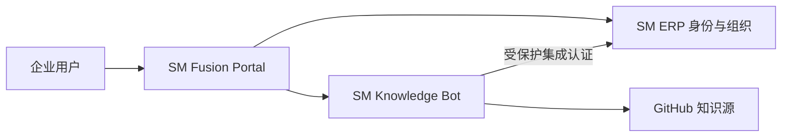

# SM Fusion Platform

**桌面正式版：** [查看最新发布](https://github.com/luoshitianchen/SM-Fusion-Platform/releases/latest)

当前版本：`v2.0.0`。桌面端会检查 GitHub 最新正式版本，仅提示并打开发布页，不会静默下载或执行更新。

对标企业治理实践：每个项目必须声明服务版本、租户隔离边界、合规标签、SLO、业务等级、负责人和运维联系方式，治理接口统一输出合规与多租户汇总。

企业治理能力包括责任团队、业务等级、SLO 目标、运行环境、关键故障识别、项目搜索和状态筛选。新增项目时在 `config/services.json` 声明治理元数据即可纳入统一工作台。

多态融合企业平台，将 `SM-ERP` 的身份与组织治理、`SM-knowledge-bot` 的 RAG 与多 Agent 能力统一编排，并提供企业融合门户和聚合健康状态。

融合工作台提供服务健康概览、整体可用率、探测延迟、自动刷新、故障提示以及组织管理、知识问答和知识源同步快捷入口。

## 一键部署

```powershell
git clone https://github.com/luoshitianchen/SM-Fusion-Platform.git
cd SM-Fusion-Platform
Copy-Item .env.example .env
docker compose up --build -d
```

启动前必须在 `.env` 替换集成密钥、ERP 管理员密码和 SM4 密钥。随后访问：

- 融合门户：http://127.0.0.1:8200
- ERP：http://127.0.0.1:8100
- 知识库：http://127.0.0.1:8010

三个入口默认仅绑定 `127.0.0.1`。生产环境应置于企业 VPN 或零信任网关之后，并由 KMS/HSM 注入密钥。

## 可扩展项目目录

当前服务目录位于 `config/services.json`，已注册融合门户、ERP 和知识库三个项目。新增企业项目时追加一项 `id`、`name`、`internal_url`、`public_url`、`health_path` 和 `description` 即可，不需要修改或重新编译门户后端。

## 服务器部署

将 `.env` 中的 `FUSION_BIND_ADDRESS` 设置为服务器受控内网 IP，通过企业反向代理提供 HTTPS，再由防火墙、VPN 或零信任网关限制访问来源。不要直接把三个容器端口开放到公网。

桌面端连接服务器时，将 `desktop/desktop-config.example.json` 复制为 EXE 同目录的 `desktop-config.json`，填写服务器 HTTPS 门户地址。同一个桌面安装包可以在本机与服务器模式之间切换。

## 本地开发融合门户

```powershell
py -3.11 -m venv .venv
.\.venv\Scripts\Activate.ps1
pip install -r requirements.txt
uvicorn app.main:app --reload --port 8200
```

## Windows 桌面端

桌面端目录提供原生 Tkinter 企业客户端。客户端动态读取三个项目及后续新增项目，不保存 ERP 密码、Token 或国密密钥。

```powershell
docker compose up -d
cd desktop
.\start.cmd
```

推送版本标签后，GitHub Actions 会发布经过 Defender 扫描的目录型 Windows EXE ZIP 与 SHA-256 校验文件。单文件自解压 EXE 已停止发布；企业分发仍应使用组织代码签名证书签名。

## 持续更新

- 所有变更提交到 `main` 并由 CI 执行测试和 Docker 配置校验；
- Dependabot 每周检查 Python 与 GitHub Actions 依赖；
- 安全工作流执行依赖审计、CodeQL 和密钥泄露扫描；
- 正式版本使用 `v主版本.次版本.修订号` 标签；
- Desktop Release 同时发布目录型 Windows EXE ZIP 与 `SHA256SUMS.txt` 校验文件；
- 版本变化记录在 [CHANGELOG.md](CHANGELOG.md)。

## 架构



## v2.1 企业维护升级
- 统一版本提升到 `2.1.0`，门户、桌面端和服务目录保持松耦合，便于继续添加新项目。
- 服务目录继续通过 `config/services.json` 扩展，无需修改核心门户代码。
- 增强安全响应头和服务探测缓存，降低页面探测对后端项目的压力。

### v2.1 运维观测接口
门户提供聚合运行指标：

```powershell
Invoke-RestMethod http://127.0.0.1:8200/api/ops/metrics
```

返回门户请求总量和错误总量，可与服务目录健康探针组合展示。

### v2.1 本地质量门禁
提交前推荐执行：

```powershell
.\quality.ps1
```

如只进行快速回归测试：

```powershell
.\quality.ps1 -SkipAudit
```

## v2.2 全量升级
- 门户版本统一提升到 `2.2.0`。
- 保持服务治理、健康探测、质量门禁与容器加固能力同步。

## v2.3 安全防护增强
- 门户版本统一提升到 `2.3.0`。
- CSP 增加 `connect-src`、`img-src`、`form-action`，收紧浏览器侧资源加载边界。
- 继续保留容器只读文件系统、能力剥离、进程数限制和本地绑定默认策略。

## v2.4 全项目链路打通
- 服务目录从 3 个项目扩展到 13 个项目，统一接入 ERP、知识库、IAM、API 网关、审计中心、监控、DevSecOps、审批、数据治理、服务台、CMDB 与 AgentOps。
- `docker-compose.yml` 已纳入 10 个新增项目，默认仍全部绑定 `127.0.0.1`，通过融合门户统一探测健康状态。
- `/api/overview`、`/api/services`、`/api/governance` 会自动展示全部项目的责任团队、SLO、合规标签、租户边界和运行状态。

### 全量链路启动

```powershell
git clone https://github.com/luoshitianchen/SM-Fusion-Platform.git
cd SM-Fusion-Platform
Copy-Item .env.example .env
# 修改 .env 中的 ERP_BOOTSTRAP_PASSWORD、ERP_SM4_KEY_HEX、FUSION_INTEGRATION_KEY
docker compose up --build -d
```

统一入口：`http://127.0.0.1:8200`。


## v2.5 链路契约升级
- 10 个新增企业项目统一升级到 `1.1.0`，新增 `/api/integration/manifest` 服务契约接口。
- 服务目录为新增项目补充 `manifest_path`，后续可由融合门户、监控、CMDB、审计中心自动发现链路依赖。
- 链路契约声明 dependencies、events、health_path、metrics_path、overview_path，作为真实互调前的企业治理基础。


## v3.0 大版本安全治理升级
- 融合门户版本升级到 `3.0.0`。
- 10 个新增企业项目统一升级到 `2.0.0`，服务目录同步更新。
- 新增项目统一具备请求体限制、接口速率限制和可选内部写入令牌。
- 服务链路契约继续通过 `manifest_path` 纳管，便于后续网关、审计、监控和 CMDB 真实互联。


## v3.1 全链路国密升级
- 融合门户升级到 `3.1.0`。
- 10 个企业子项目统一接入 `gmssl`，提供 SM3 摘要与 SM4 能力状态接口。
- 国密密钥只允许通过环境变量或企业 KMS/HSM 注入。


## v3.2 所有项目国密同步
- 融合门户升级到 `3.2.0`。
- ERP 与 Knowledge Bot 同步纳入全量国密状态检查。
- 服务目录核心项目版本同步到 `2.4.0`，新增项目保持 `2.0.0` 国密版本。


## v3.3 平台重建升级
- 新增 `contracts/integration.schema.json`，统一校验所有项目链路契约。
- 新增 `deploy/k8s/fusion-platform.yaml`，提供非 root、只读文件系统、seccomp、健康探针和副本数配置。
- 所有子项目新增 `/api/security/baseline`，融合平台可纳入统一安全基线检查。

## v3.4 生产部署完善
新增 Helm Chart：

```text
deploy/helm/sm-fusion-platform
```

包含：
- Deployment 多副本
- Service
- HPA 自动扩缩容
- NetworkPolicy 东西向访问控制
- 非 root、只读根文件系统、seccomp、能力剥离
- 内存 tmpfs
- 健康探针与资源 requests/limits

安装示例：

```powershell
helm upgrade --install sm-fusion ./deploy/helm/sm-fusion-platform -n sm-enterprise --create-namespace
```

## v3.5 数据层与可观测性完善
新增 `docker-compose.data.yml`，提供：
- PostgreSQL 16
- Redis 7 持久化
- Qdrant 向量数据库
- `/metrics` Prometheus 文本指标

启动数据层：

```powershell
Copy-Item .env.example .env
docker compose -f docker-compose.data.yml up -d
```

生产环境应使用托管 PostgreSQL/Redis/Qdrant，并通过 KMS 注入密码和连接凭据。

## 全面检测结论（2026-08-22）
- 13 个项目均已通过 Python 编译检查。
- 核心服务测试：Knowledge Bot 18 passed、ERP 16 passed、Fusion 8 passed。
- 10 个企业子项目均为 8 passed。
- Fusion 依赖探测已关闭系统代理继承（`trust_env=False`），并将探测超时收紧为连接 0.75 秒、总计 1.5 秒，避免本地无依赖服务时长时间卡顿。
- 本地单独启动门户时，依赖项目显示 `unavailable/degraded` 属于真实依赖未启动状态；部署完整 Compose/Kubernetes 链路后再验证整体 `healthy`。


## 2026-08-22 维护记录
- 完成源码编译检查、单元测试和工作区状态检查。
- 保持安全响应头、TrustedHost、限流、请求大小限制、国密 SM3/SM4 与内部令牌控制。
- 维护建议：生产环境通过 KMS/HSM 注入密钥，依赖项目全部启动后再执行融合门户整体健康检查。
