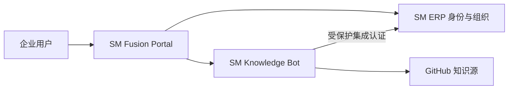

# SM Fusion Platform

**Windows 正式版：** [下载 v1.0.0 桌面客户端](https://github.com/luoshitianchen/SM-Fusion-Platform/releases/download/v1.0.0/SM-Fusion-Platform.exe) · [查看发布说明](https://github.com/luoshitianchen/SM-Fusion-Platform/releases/tag/v1.0.0)

多态融合企业平台，将 `SM-ERP` 的身份与组织治理、`SM-knowledge-bot` 的 RAG 与多 Agent 能力统一编排，并提供企业融合门户和聚合健康状态。

融合工作台提供服务健康概览、整体可用率、探测延迟、自动刷新、故障提示以及组织管理、知识问答和知识源同步快捷入口。

## 一键部署

```powershell
git clone https://github.com/luoshitianchen/SM-Fusion-Platform.git
cd SM-Fusion-Platform
Copy-Item .env.example .env
docker compose up --build -d
```

启动前必须在 `.env` 替换集成密钥、ERP 管理员密码和 SM4 密钥。随后访问：

- 融合门户：http://127.0.0.1:8200
- ERP：http://127.0.0.1:8100
- 知识库：http://127.0.0.1:8010

三个入口默认仅绑定 `127.0.0.1`。生产环境应置于企业 VPN 或零信任网关之后，并由 KMS/HSM 注入密钥。

## 可扩展项目目录

当前服务目录位于 `config/services.json`，已注册融合门户、ERP 和知识库三个项目。新增企业项目时追加一项 `id`、`name`、`internal_url`、`public_url`、`health_path` 和 `description` 即可，不需要修改或重新编译门户后端。

## 服务器部署

将 `.env` 中的 `FUSION_BIND_ADDRESS` 设置为服务器受控内网 IP，通过企业反向代理提供 HTTPS，再由防火墙、VPN 或零信任网关限制访问来源。不要直接把三个容器端口开放到公网。

桌面端连接服务器时，将 `desktop/desktop-config.example.json` 复制为 EXE 同目录的 `desktop-config.json`，填写服务器 HTTPS 门户地址。同一个桌面安装包可以在本机与服务器模式之间切换。

## 本地开发融合门户

```powershell
py -3.11 -m venv .venv
.\.venv\Scripts\Activate.ps1
pip install -r requirements.txt
uvicorn app.main:app --reload --port 8200
```

## Windows 桌面端

桌面端目录提供原生 Tkinter 企业客户端和 PyInstaller 发布流程。客户端动态读取三个项目及后续新增项目，不保存 ERP 密码、Token 或国密密钥。

```powershell
docker compose up -d
cd desktop
.\build.ps1
.\dist\SM-Fusion-Platform.exe
```

推送版本标签（例如 `v1.0.0`）后，GitHub Actions 会在 Windows Runner 构建并发布 `SM-Fusion-Platform.exe` 到 Release。发布前请先在企业环境验证门户地址、签名策略和杀毒软件兼容性。

## 持续更新

- 所有变更提交到 `main` 并由 CI 执行测试和 Docker 配置校验；
- Dependabot 每周检查 Python 与 GitHub Actions 依赖；
- 安全工作流执行依赖审计、CodeQL 和密钥泄露扫描；
- 正式版本使用 `v主版本.次版本.修订号` 标签；
- Windows Release 同时发布 EXE 与 `SHA256SUMS.txt` 校验文件；
- 版本变化记录在 [CHANGELOG.md](CHANGELOG.md)。

## 架构


