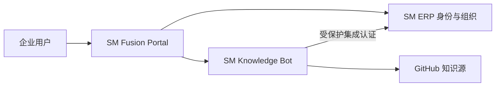

# SM Fusion Platform

多态融合企业平台，将 `SM-ERP` 的身份与组织治理、`SM-knowledge-bot` 的 RAG 与多 Agent 能力统一编排，并提供企业融合门户和聚合健康状态。

## 一键部署

```powershell
git clone https://github.com/luoshitianchen/SM-Fusion-Platform.git
cd SM-Fusion-Platform
Copy-Item .env.example .env
docker compose up --build -d
```

启动前必须在 `.env` 替换集成密钥、ERP 管理员密码和 SM4 密钥。随后访问：

- 融合门户：http://127.0.0.1:8200
- ERP：http://127.0.0.1:8100
- 知识库：http://127.0.0.1:8010

三个入口默认仅绑定 `127.0.0.1`。生产环境应置于企业 VPN 或零信任网关之后，并由 KMS/HSM 注入密钥。

## 本地开发融合门户

```powershell
py -3.11 -m venv .venv
.\.venv\Scripts\Activate.ps1
pip install -r requirements.txt
uvicorn app.main:app --reload --port 8200
```

## 架构


